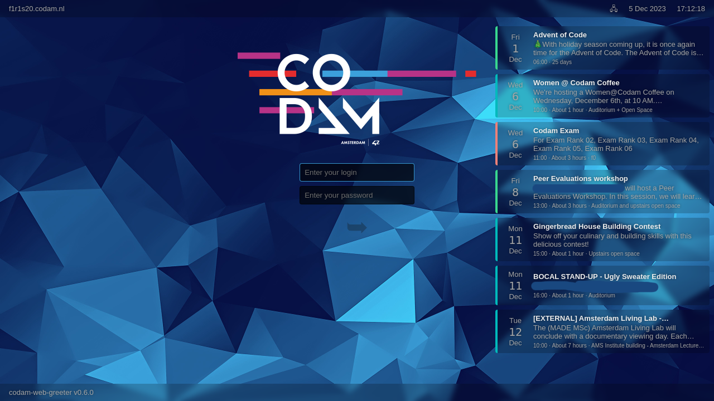
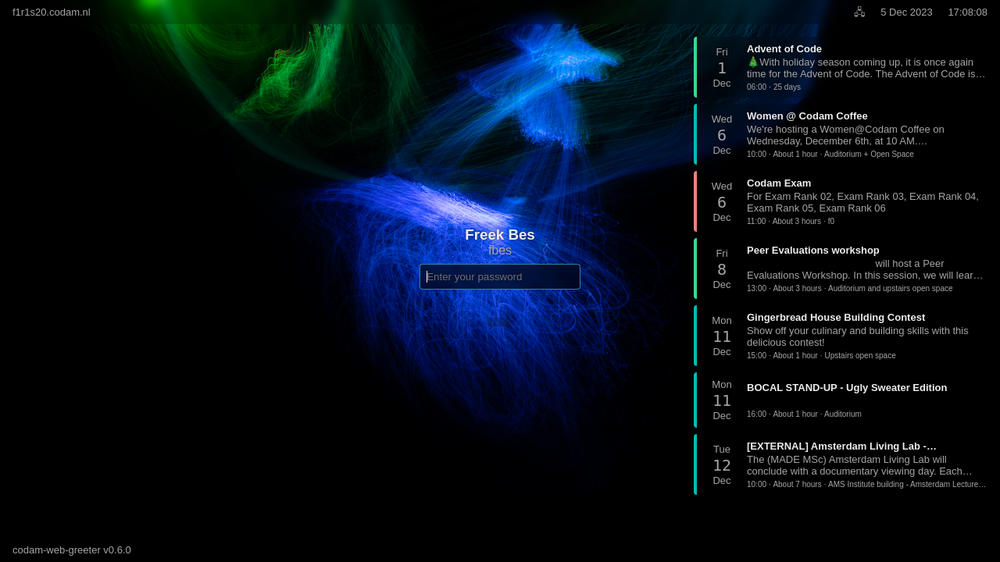

# codam-web-greeter
A greeter theme for [nody-greeter](https://github.com/JezerM/nody-greeter)/[web-greeter](https://github.com/JezerM/web-greeter) in LightDM, made specifically for [Codam Coding College](https://codam.nl/en).

---

## Features

- Responsive design
- Display upcoming events and exams from the Intranet
- Prevent students from signing in with their regular account during exams
- Customizable background image and logo
- Greeter can be used as a lock screen when someone is already logged in (replacement for ft_lock)
- Automatically log students out after 42 minutes of inactivity, either in-session or on the lock screen
- Display user's Intra picture on the lock screen
- Display user's Gnome wallpaper on the lock screen
- Keybinding to gracefully reboot the computer (<kbd>Ctrl</kbd>+<kbd>Alt</kbd>+<kbd>Del</kbd>)
- Display network status on-screen without having to log in
- Screen brightness control support
- Choose between light or dark mode upon installation


## Screenshots




## Installation

> Caution: make sure you know how to restore your system if something goes wrong. This theme is made specifically for Codam and might not always work as intended in other 42 schools, let alone different environments. For 42 schools, it is recommended to install this theme using the [provided Ansible role](https://github.com/codam-coding-college/ansible-codam-web-greeter) on ansiblecluster.

1. Install dependencies:
```bash
sudo apt install lightdm light-locker xprintidle
```

2. Install [nody-greeter](https://github.com/JezerM/nody-greeter/releases) or [web-greeter](https://github.com/JezerM/web-greeter/releases) by downloading the deb from the corresponding releases page. Alternatively, you can install it by compiling from source (don't forget to clone the repository with the `--recursive` flag to include its submodules).

4. Download the latest stable release of the greeter theme from the [releases page](https://github.com/codam-coding-college/codam-web-greeter/releases):
```bash
wget https://github.com/codam-coding-college/codam-web-greeter/releases/latest/download/codam-web-greeter-dark-default.zip
unzip codam-web-greeter-dark-default.zip
```

4. Install the greeter theme:
```bash
install -dm755 /usr/share/web-greeter/themes/codam
cp -r codam-web-greeter /usr/share/web-greeter/themes/codam
bash /usr/share/web-greeter/themes/codam/systemd/install.sh
```

5. Specify to use nody-greeter in LightDM by editing */etc/lightdm/lightdm.conf*:
```conf
# Add the following line to the file under [SeatDefaults]:
greeter-session=nody-greeter
```
or if using web-greeter:
```conf
# Add the following line to the file under [SeatDefaults]:
greeter-session=web-greeter
```

6. Enable the greeter theme by editing */etc/lightdm/web-greeter.yml*:
```yml
# Replace the theme name with codam-web-greeter:
greeter:
    theme: codam
```

7. Restart LightDM:
```bash
sudo systemctl restart lightdm
```


## Development

### Client
Use the provided Makefile to build the theme:
```bash
make
```

You can optionally build the theme in light mode:
```bash
make CLIENT_THEME=light
```

Or in light mode with a boxed form to make the login/unlock form more readable:
```bash
make CLIENT_THEME=light CLIENT_THEME_BOXED=boxed
```


#### Debugging the client
You can then open the *static/index.html* file in your browser to do some basic editing, but for most things you'll want to install the greeter on your system and run it in debug mode.

Add the following line to `/usr/share/xsessions/ubuntu.desktop`:
```conf
X-LightDM-Allow-Greeter=true
```

This will allow you to run the greeter in debug mode while logged in as a regular user by installing the greeter like normally and running the following command:
```bash
nody-greeter --debug
# or if using web-greeter: web-greeter --debug
```

You can then open the Developer Tools sidebar from the greeter's menu and view the console output for any warnings and/or errors.

Do not forget to remove the line from `/usr/share/xsessions/ubuntu.desktop` after you're done debugging - it's a security risk to allow the greeter to be run by regular users.


### Server
Use the provided Makefile to build the server or use the docker-compose file in the *server/* directory directly:
```bash
# Makefile method
make server

# Docker-compose method
cd server
docker compose up
```


## Troubleshooting

### Locking the screen doesn't work at all
Make sure the LightDM config allows user-switching. Add the following line to */etc/lightdm/lightdm.conf*:
```conf
[SeatDefaults]
...
allow-guest=false
allow-user-switching=true
greeter-hide-users=true
greeter-show-manual-login=true
```

Also, make sure you have the `light-locker` package installed on your system.

### Locking the screen shows the login screen
Modify the [LightDM hooks](https://www.freedesktop.org/wiki/Software/LightDM/CommonConfiguration/).

- Add the following lines to the greeter setup hook defined in */etc/lightdm/lightdm.conf*:
```bash
# Get a list of all active user sessions on the system with loginctl
USER_SESSIONS=$(/usr/bin/loginctl list-sessions --no-legend | /usr/bin/awk '{print $3}')

# Loop over all sessions and cache them with dbus-send
# This is required for the codam-web-greeter and other lock screens to work properly (fetch the list of users)
for USER in $USER_SESSIONS; do
	# Cache the user
	/usr/bin/dbus-send --system --print-reply --type=method_call --dest=org.freedesktop.Accounts /org/freedesktop/Accounts org.freedesktop.Accounts.CacheUser string:"$USER" || true
done
```

- Add the following lines to the logout hook defined in */etc/lightdm/lightdm.conf*:
```bash
# Uncache the user
/usr/bin/dbus-send --system --print-reply --dest=org.freedesktop.Accounts /org/freedesktop/Accounts org.freedesktop.Accounts.UncacheUser string:$USER || true
```

### LightDM's logout hook is called upon the greeter exiting and starting a user session
Add the following lines to the top of the logout hook defined in */etc/lightdm/lightdm.conf*:
```bash
# Check if the hook was called from a greeter exiting or a student session exiting
# Display :0 is used for the first greeter and gets reused for the student session.
# Display :1 is used for the second login (user switching, in fact the Codam lock screen).
# We do not allow switching users, so for :1 there is no user session
# to clean up for. Instead, the hook was called to clean up the greeter.
# No cleaning needs to be done for the greeter. So, we simply exit.
# Source: https://www.freedesktop.org/wiki/Software/LightDM/CommonConfiguration/
if [ "$DISPLAY" != ":0" ]; then
	echo "Catched greeter logout event, exiting"
	exit 0
fi
```

### Users are sometimes randomly logged out after locking their screen once
Add the following lines to the top of the logout hook defined in */etc/lightdm/lightdm.conf*:
```bash
# Delete any lock_time files in /tmp (used by codam-web-greeter to know when the screen was locked
# and when to automatically log out the user)
/usr/bin/rm -f /tmp/codam_web_greeter_lock_timestamp_*
```
Make sure to add these lines above the lines added in the previous section (the check for the greeter logout event).

### My custom wallpaper or logo doesn't show up
Make sure the folders mentioned for branding in */etc/lightdm/web-greeter.yml* exist and contain the correct files.
```yaml
branding:
    background_images_dir: /usr/share/codam/web-greeter
    logo_image: /usr/share/codam/web-greeter/logo.png
    user_image: /usr/share/codam/web-greeter/user.png
```
For 42 schools, link */usr/share/42/login-screen.jpg* to the */usr/share/codam/web-greeter/login-screen.png*. Place your campus's logo in */usr/share/42/logo.png* and a default user icon in */usr/share/42/user.png*. The background initially set for ft_lock is not used.

### The user's profile picture is not displayed on the lock screen
Make sure you install the systemd services included in the greeter theme. One of these services copies the `~/.face` file to */tmp* for the greeter to use.

### The screen blanks on the login screen
This is a known issue with LightDM. To fix it, add the following line to */etc/lightdm/lightdm.conf*:
```conf
[SeatDefaults]
...
display-setup-script=/usr/bin/xset s off
```
Alternatively, `/usr/bin/xset s off` can be added to the greeter setup hook defined in */etc/lightdm/lightdm.conf*.

You might also have to disable the screensaver in the web-greeter settings in */etc/lightdm/web-greeter.yml*.

### The screen blanks on the lock screen
Best solution: use `dm-tool switch-to-greeter` instead of `dm-tool lock` to lock the screen.

Alternatively, add the following line to the greeter setup hook defined in */etc/lightdm/lightdm.conf*:
```bash
/usr/bin/xset dpms force off
```
However, this will cause the login screen to blank instead.

### Rebooting doesn't work in the lock screen
Check if rebooting from the *lightdm* user is allowed by PolKit. For example, add the following lines to */etc/polkit-1/localauthority/20-org.d/org.freedesktop.login1.pkla*:
```conf
[Enable reboot by default for lightdm user]
Identity=unix-user:lightdm
Action=org.freedesktop.login1.reboot;org.freedesktop.login1.reboot-multiple-sessions;org.freedesktop.login1.reboot-ignore-inhibit;
ResultAny=yes
ResultInactive=yes
ResultActive=yes
```

### The power button powers off the system when the greeter is active
Modify the logind configuration on what to do when the power button is pressed. For example, add the following lines to */etc/systemd/logind.conf*:
```conf
[Login]
...
HandlePowerKey=ignore
HandleSuspendKey=ignore
HandleHibernateKey=ignore
```
Don't forget to restart logind after modifying: `sudo systemctl restart systemd-logind`
